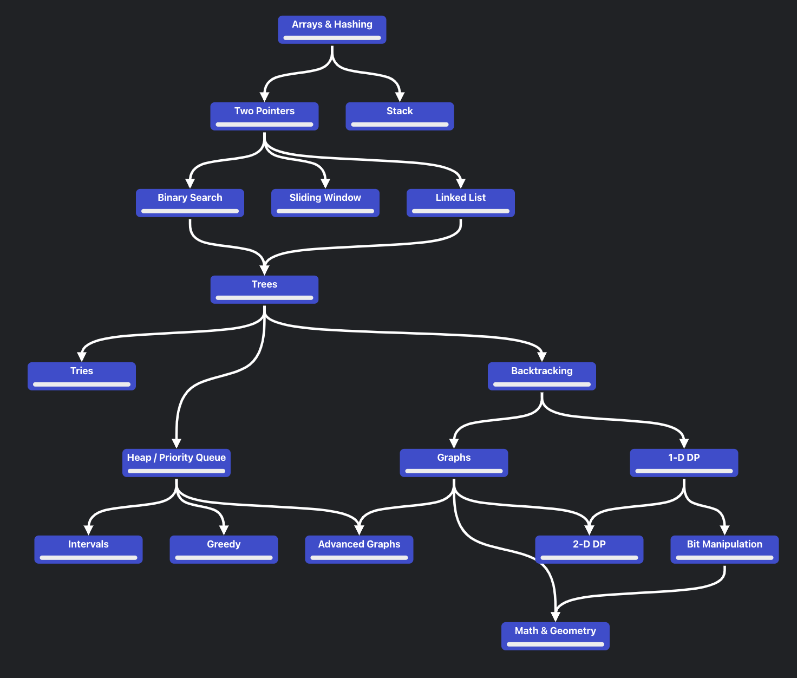

# About

As a part of my software developement journey I decided that i need to crack the algo so I decided to start solving Leetcode problems on somewhat daily basis. This is the documentation of my journey (i hope it will be).

## Navigate to

1. [Arrays & Hashing](Topics/Arrays&Hashing/)
    1. [Contains Duplicate](Topics/Arrays&Hashing/contains_duplicate)
    2. [Valid Anagram](Topics/Arrays&Hashing/valid_anagram)

## Roadmap

> *this roadmap was taken from https://neetcode.io/roadmap*
